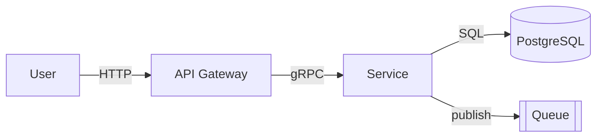
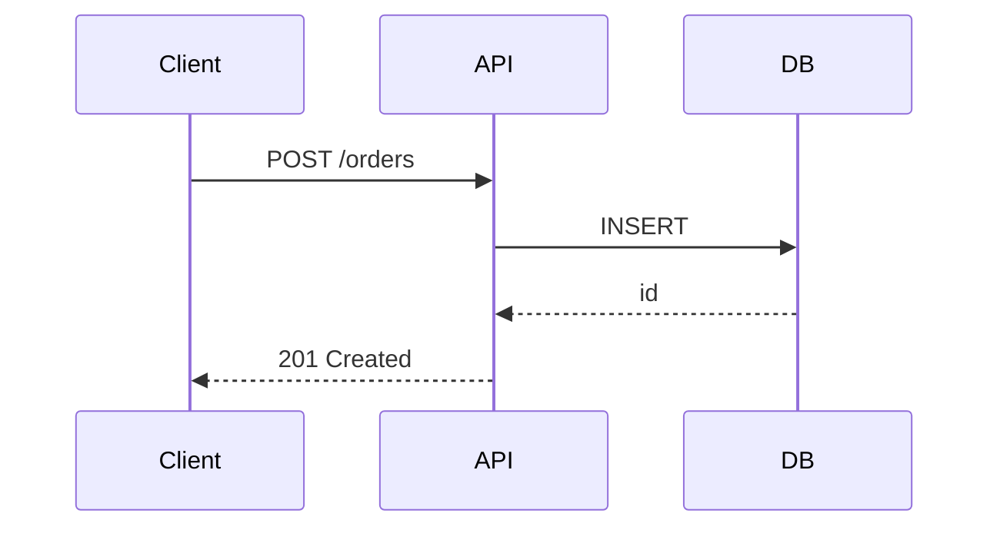
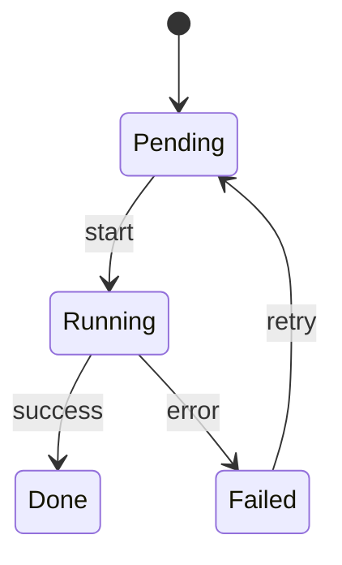
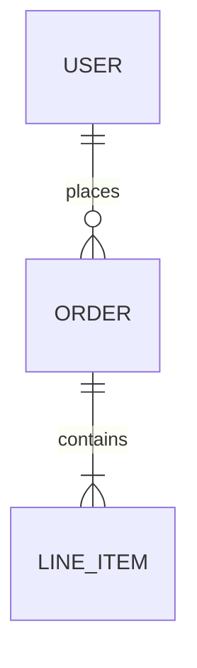

# DOCS — Architecture diagrams (Mermaid)

Diagrams live beside the prose they describe. Mermaid renders natively on
GitHub / Forgejo / Gitea / Obsidian — no extra tooling needed to view.

## When to include

- Any agent/skill that scaffolds documentation for a multi-component system
- Any repo with ≥ 3 services / layers / subsystems

## Four diagram patterns (use the right one)

### 1. System context (C4 level 1) — `flowchart LR`



Use for: one-page overview, onboarding, README architecture section.

### 2. Sequence — `sequenceDiagram`



Use for: request flow, auth handshake, error recovery sequence.

### 3. State machine — `stateDiagram-v2`



Use for: job lifecycle, FSM-driven features, connection state.

### 4. ER / data model — `erDiagram`



Use for: DB schema summary. Keep ≤ 10 entities per diagram.

## Rules

- **Diagram-as-code, no binary exports.** `.mmd` or fenced block, never `.png`
- **≤ 15 nodes / 20 edges per diagram.** Over that → split
- **Labels are nouns.** Edges are verbs. No prose inside nodes
- **One diagram = one concern.** Don't mix system context + sequence in one chart
- **Preview locally** with `mmdc` before commit: `mmdc -i diagram.mmd -o /tmp/preview.svg`
- **Link to source in caption** — "See `docs/diagrams/orders.mmd` for source"

## Forbidden

- ASCII art for multi-node graphs (use Mermaid — renders everywhere)
- Diagrams that contradict the code (stale → delete or fix)
- Secrets / real hostnames / IPs in diagrams (use placeholders)

## Install `mmdc` (preview tool)

```
npm install -g @mermaid-js/mermaid-cli    # one-time
mmdc -i docs/diagrams/context.mmd -o /tmp/preview.svg
```

## References

- Mermaid syntax — https://mermaid.js.org/intro/ [VERIFIED: https://mermaid.js.org/intro/]
- C4 model — https://c4model.com/ [VERIFIED: https://c4model.com/]
- `~/.claude/rules/doc-conventions.md`
